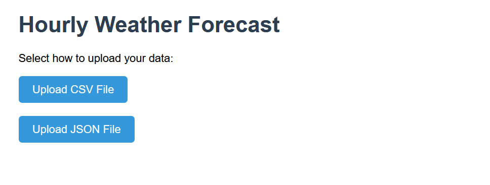
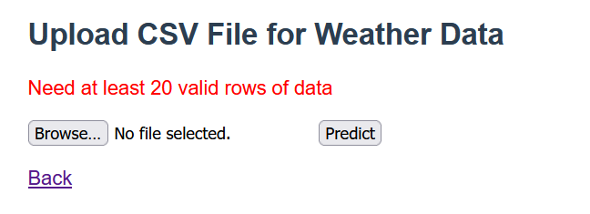
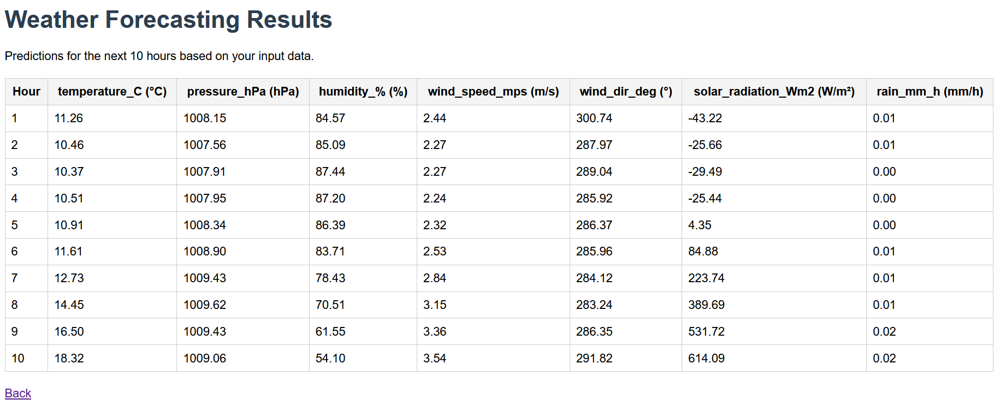

# Weather Forecasting API
## Introduction
This is API done using FLask to hourly forecast weather. We support the API with the previous 20 hourly data to predict the upcoming 10 hours. You can upload the data whether through json file or csv file. And it accepts the timestamps in different formats.

## Weather Features
It works with these 7 features with the corresponding units: 
| Feature              | Unit    |
| -------------------- | ------- |
| Temperature          |  °C     |
| Pressure             |   hPa   |
| Humidity             |   %     |
| Wind Speed           |   m/s   |
| Wind Direction       |   °     |
| Solar Radiation      |   W/m²  |
| Rain                 |   mm/h  |

## Usage
The home page guide you to upload your data through two ways. It has two buttons: one for CSV files and the other for JSON files. It is shown as this


When you select any button, it guide you to a different URL, asking you to browse and upload you data file. Each URL accepts only files as you selected before whether CSV or JSON files.

If there's any error with the file or no enough data, it gives an error message and asks for another file.
Here's an example when an error happens.


When you upload the file correctly and press the predict button, it directs you for the forecast, shown as table with the 7 features for the upcoming 10 hours.
This image shows an example of the forecast.


## Endpoints

### 1. / (Home route)
- *Method*: GET
- *Description*: guide you to upload your data through the suitable way. You select to upload data via CSV file or JSON file.

### 2. /uploadCSV
- *Method*: GET & POST
- *Description*: when you select *csv* button from the home page, it guides you to this URL. Accepting only csv files, you browse and upload your data file, then press the button predict to get the model predictions. It first checks the file and then displays the forecast.

### 2. /uploadJOSN
- *Method*: GET & POST
- *Description*: when you select *JSON* button from the home page, it guides you to this URL. Accepting only json files, you browse and upload your data file, then press the button predict to get the model predictions. It first checks the file and then displays the forecast.


## Usage

### 1. Clone the repository 
```
git clone https://github.com/DohaRagab1/WeatherForecasting.git
```

### 2. Install the required packages
```
pip install -r requirements.txt
```

### 3. Initialize the Flask server
Run `app.py` to initialize the server and open the current URL (in the terminal, Flask server). You can see the main route, and select the suitable way to upload your data files.

### 4. Test with CSV files
You can test with examples of csv files in `Test folder` or your own file. After pressing the CSV button, browse to the csv file and press predict button to get the model predictions.

### 5. Test with JSON files
You can test with examples of json files in `Test folder` or your own file. After pressing the json button, browse to the json file and press predict button to get the model predictions.


## Code Overview

### App.py
This is the main python file that deploys the model. It creates the Flask app and defines the different routes. It loads the model and get the predictions from it. It also preprocesses and postprocesses the data before and after sending to the model.

### Templates Folder
It contains different html files to make a friendly user interface for each stage.

#### Index.html
This is the main page that asks the user to select the suitable way to upload data. Based on the pressed button, it directs the user to different URL.

#### UploadCSV.html
It has two buttons: one to browse files to upload csv file and the other to get the model predictions. It displays the model predictions or if there's any error with the file.
It has a hyperlink to get back to the home page.

#### UploadJSON.html
It has two buttons: one to browse files to upload json file and the other to get the model predictions. It displays the model predictions or if there's any error with the file.
It has a hyperlink to get back to the home page.

#### Result.html
It gets the model predictions and displays them in a well-formatted table.
It has a hyperlink to get back to the home page.


### Statics Folder
It contains style.css file for the style and overall design of the project.

### Test Folder
It contains several csv and json files to test our model. You can test with your own files or upload directly from this folder.